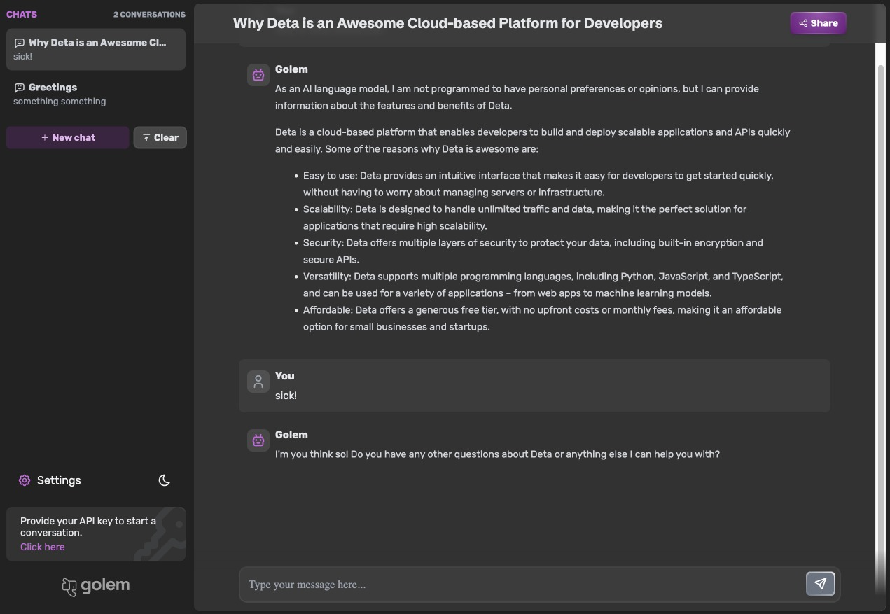

<div align="center">


> Golem is an open-source conversational UI and alternative to ChatGPT

</div>




## 🚀 Key Features:

- ✅ Access to GPT-3.5 / GPT-4 APIs
- 🎨 Customizable UI
- 🌑 Dark mode
- 🗑️ Delete messages

## ☁ Host on the Personal Cloud with Deta

- 🔑 Your data and conversations only belong to you
- 📦 Integrate easily with other apps, everything on the personal cloud is programmable
- 💠 Cross device synchronisation
- 🍻 Share chat history

<div align="center">
<a href="https://deta.space/discovery/@henrycunh/golem" _target="blank">

</a>
</div>

## 🛠 Configuration
You can use **environment variables** to customize your instance.

| Variable | Description |
| -------- | ----------- |
| **`GOLEM_PASSWORD`** | Protects the instance with this password, which will be prompted at every usage. |
| **`OPENAI_API_KEY`** | Enforces the usage of this API Key on the instance. |

## 🐳 Running on Docker
You can run Golem on Docker with the following command:

```bash
docker run -p3000:3000 theajax/golem
```

## 🗺️ Roadmap:

- ⭐️ Favorite messages and conversations
- 🔎 Search messages
- 📄 External knowledge (documents, websites, etc.) support
- 🤖 Additional AI language models support
- 🌍 Multi-language support
- 🔌 Plugins support


